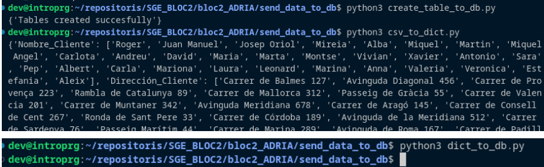
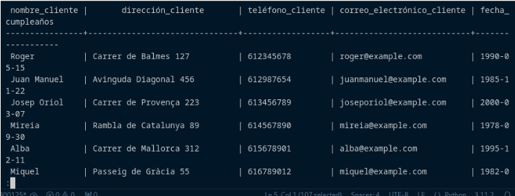

# SGE_BLOC2

## PAS A PAS

### PAS 1
- Es crea la carpeta bloc2_ADRIA.

### PAS 2
- Dins de bloc2_ADRIA, es crea la carpeta postgresql_python.

### PAS 3
- Dins de postgresql_python, es crean els arxius .py (connect, create_registre, delete_registre, main, read_registre i update_registre).

### PAS 4
- S'obren les carpetes amb un IDE, en el meu cas he utilitzat Visual Studio Code.

### PAS 5
- Abans de començar, s'intal·la psycopg2 i pandas.
- Es segueixen els pasos per instal·lar docker engine.
- Es crea l'arxiu docker-compose.yml a una carpeta anomenada dockerCompose
- S'entra a la carpeta i s'executa la comanda "sudo docker-compose up -d" per activar els serveis.
- S'escriu l'arxiu connect.py manualment amb el codi indicat.
- A la seguent captura es veu es resultat de l'execució de connect.py. Es pot veure l'usuari, la contrasenya censurada, el nom de la BD, el host, el port i indica que closed: 0 que vol dir que close = false, per tant, està obert.

### PAS 6 
- Es crea la carpeta send_data_to_db
- Es descarrega la taula de clients com a csv.
- Es crean i escriuen els arxius create_table_to_db, csv_to_dict i dict_to_db manualment dins de send_data_to_db amb el codi indicat.
- A la següent captura es veu l'execució dels 3 programes creats, al primer arxiu s'ha afegit un print per visualitzat que s'han creat correctament les taules, el segon arxiu passa el csv a diccionari i finalment es pasa el diccionari a la base de dades.

### PAS 7
- S'escriuen els arxius create_registre i main.py manualment amb el codi indicat.
- S'executa main.py que crida a create_registre i mostra un missatge igual que el de connect.py
- S'accedeix a la DB amb la comanda “psql -h localhost -U admin -d the_bear” i introduïnt la contrasenya
- A la següent captura es veu la taula creada desde la terminal utilitzant l'ordre "SELECT * from Clientes;"

### PAS 8
- S'introdueix el codi del 3 arxius restants manualment (read_registre.py, update_registre.py i delete_registre.py)