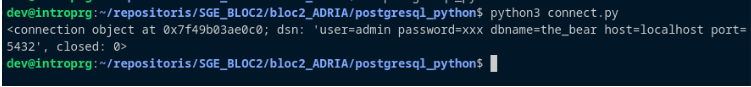

# SGE_BLOC2

## PAS A PAS

### PAS 1
- Es crea la carpeta bloc2_ADRIA

### PAS 2
- Dins de bloc2_ADRIA, es crea la carpeta postgresql_python

### PAS 3
- Dins de postgresql_python, es crean els arxius .py (connect, create_registre, delete_registre, main, read_registre i update_registre)

### PAS 4
- S'obren les carpetes amb un IDE, en el meu cas he utilitzat Visual Studio Code

### PAS 5
- Abans de començar, s'intal·la psycopg2 i pandas
- Es segueixen els pasos per instal·lar docker engine
- Es crea l'arxiu docker-compose.yml a una carpeta anomenada dockerCompose
- S'entra a la carpeta i s'executa la comanda "sudo docker-compose up -d" per activar els serveis
- S'escriu l'arxiu connect.py amb el codi indicat
- A la seguent captura es veu es resultat de l'execució de connect.py. Es pot veure l'usuari, la contrasenya censurada, el nom de la BD, el host, el port i indica que closed: 0 que vol dir que close = false, per tant, està obert.

